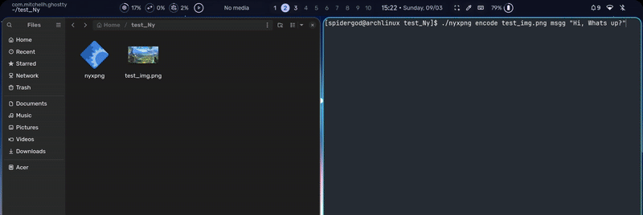

# NyxPNG

**NyxPNG** is a Rust-based command-line tool that lets you hide secret messages in PNG image files. This project was built for learning purposes, focusing on understanding the PNG file format and practicing systems programming in Rust. With NyxPNG, you can embed messages into PNG files, extract them later, remove hidden message data, and inspect the PNG's structure via its chunks.

## Features

- **Encode** – Insert (hide) a secret text message into a PNG file by adding a new PNG chunk containing the data.  
- **Decode** – Retrieve and display a hidden message from a PNG file (if one exists in the specified chunk).  
- **Remove** – Delete a hidden message by removing its corresponding chunk from the PNG file, restoring the file to its original state (minus the secret chunk).  
- **Print** – List all the chunks in a PNG file, showing their types and sizes. This is useful for inspecting the PNG’s structure and verifying if a hidden message chunk is present.

Each of these functionalities is accessible via a subcommand in the NyxPNG CLI, making it easy to manipulate PNG files and their chunks from the terminal.

## Installation

### Prerequisites

- **Rust** – NyxPNG is written in Rust. You need Rust (and its package manager Cargo) installed to build and use NyxPNG. If you don't have Rust installed, you can get it via [rustup](https://www.rust-lang.org/tools/install) or refer to the official Rust installation guide.

### Building from Source

1. **Clone the repository:** Clone the NyxPNG repository from GitHub to your local machine.  
   ```bash
   git clone https://github.com/yourusername/NyxPNG.git
   ```  
2. **Change directory:** Navigate into the project folder.  
   ```bash
   cd NyxPNG
   ```  
3. **Build the project:** Use Cargo to compile NyxPNG in release mode.  
   ```bash
   cargo build --release
   ```  
   This will produce an optimized binary in the `target/release` directory (for example, `target/release/nyxpng` or `nyxpng.exe` on Windows).  
4. **(Optional) Install globally:** If you want to run NyxPNG from anywhere, you can install it to your Cargo binaries path:  
   ```bash
   cargo install --path .
   ```  
   After this, the `nyxpng` command will be available globally (usually Cargo installs binaries to `~/.cargo/bin`, which you should add to your PATH if not already).
   
## Usage

NyxPNG is used via subcommands. The general invocation is: `nyxpng <SUBCOMMAND> [OPTIONS]`. Below are examples of how to use each subcommand. Replace `<PNG_FILE>` with your PNG image path, and `<CHUNK_TYPE>` with a 4-character chunk name (e.g. "ruSt" in the examples):

### Encode

Embed a secret message into a PNG file. This adds a new ancillary chunk to the PNG that carries your message.

```bash
nyxpng encode <PNG_FILE> <CHUNK_TYPE> "<YOUR MESSAGE>"
``` 

**Example:** To hide the message "Hello Rust!" in `image.png` using a custom chunk type "ruSt":  
```bash
nyxpng encode image.png ruSt "Hello Rust!"
```  
This will insert the message into `image.png`. After running this, the file will contain a new "ruSt" chunk with the secret text.

### Decode

Read and display a secret message from a PNG file, if one is present in the specified chunk.

```bash
nyxpng decode <PNG_FILE> <CHUNK_TYPE>
``` 

**Example:** To retrieve the hidden message from `image.png` that was stored under the "ruSt" chunk:  
```bash
nyxpng decode image.png ruSt
```  
This will print the secret message to the console (for example, it would output `Hello Rust!` if that was the encoded text).

### Remove

Remove a hidden message chunk from a PNG file. This deletes the specified chunk (and its data) from the PNG.

```bash
nyxpng remove <PNG_FILE> <CHUNK_TYPE>
``` 

**Example:** To remove the "ruSt" chunk (and its hidden message) from `image.png`:  
```bash
nyxpng remove image.png ruSt
```  
After this, `image.png` will no longer contain the "ruSt" chunk or the secret message. (The file is modified in place without that chunk.)

### Print

Display all chunks present in a PNG file. This is helpful to see the PNG’s metadata and to verify if your custom message chunk is present.

```bash
nyxpng print <PNG_FILE>
``` 

**Example:** To list the chunks in `image.png`:  
```bash
nyxpng print image.png
```  
This will output a list of all chunk types in the image (e.g. `IHDR`, `tEXt`, `IDAT`, `ruSt`, `IEND`, etc.), along with each chunk’s length. Custom chunks (like the hidden message chunk) will appear in this list, so you can confirm it's embedded.

## Demo

Below is a demonstration of NyxPNG in action. This GIF shows using the CLI to encode a message into a PNG and then decode it:



### Acknowledgements  

This project was built by following *[PNGme: An Intermediate Rust Project](https://jrdngr.github.io/pngme_book/introduction.html)* by **Jared Niederer**. Huge thanks to the author for providing such a well-structured guide to learning Rust through an applied project.
